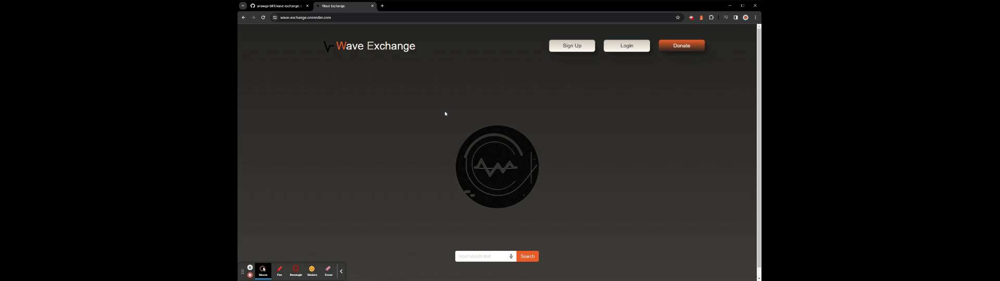

# Wave Exchange

- View the GitHub: [Repository](https://github.com/anewgard41/wave-exchange)
- Deployed Link: [Here](https://wave-exchange.onrender.com/)

## Table of Contents

- [About the Project](https://github.com/anewgard41/wave-exchange#about-the-project)
  - [Usage](https://github.com/anewgard41/wave-exchange#usage)
  - [Quick Demo](https://github.com/anewgard41/wave-exchange#quick-demo)

* [Start Your Own](https://github.com/anewgard41/wave-exchange#start-your-own)
  - [Prerequisites](https://github.com/anewgard41/wave-exchange#prerequisites)
  - [Installation](https://github.com/anewgard41/wave-exchange#installation)
  - [Test Instructions](https://github.com/anewgard41/wave-exchange#test-instructions)

- [License](https://github.com/anewgard41/wave-exchange#license)
- [Roadmap](https://github.com/anewgard41/wave-exchange#roadmap)
- [Contribute](https://github.com/anewgard41/wave-exchange#contribute)
- [Our Contact Information](https://github.com/anewgard41/wave-exchange#our-contact-information)

## About the Project

Welcome to our music-sharing platform, where the love for music comes alive! Our platform provides a vibrant space for users to seamlessly share and discover new tunes, creating a dynamic community bound by a shared passion for music exploration. With a user-friendly signup and login system, individuals can personalize their experience by saving searches and bookmarking favorite songs. Harnessing the power of GraphQL, our platform optimizes music queries and mutations, delivering a smooth and efficient browsing experience. In an effort to support talented musicians, we've integrated Stripe for seamless donation processing, culminating in a Top Donations Leaderboard that highlights and celebrates the generosity of our community. Join us on this musical journey, where every note shared is a step towards fostering a global community united by the joy of discovering and supporting incredible music talent.

### Usage

Embark on a musical odyssey with our user-friendly platform designed to enhance your music discovery experience. Sign up to unlock personalized features, allowing you to save searches and bookmark your favorite tracks for a curated library that evolves with your musical taste. Seamlessly navigate our vast music database through GraphQL, ensuring quick and tailored searches to uncover hidden gems. Be a patron of the arts by supporting talented musicians through our integrated Stripe donation system, and witness the impact of your contributions on our engaging Top Donations Leaderboard. Whether you're a music enthusiast eager to explore new sounds or an artist seeking support, our platform is the ultimate destination for connecting with a global community that shares your passion for music. Immerse yourself in a world of endless musical possibilities – sign up today and let the harmonies unfold!

### Quick Demo

## Start Your Own

### Prerequisites

1. Before you start your own instance of the Wave Exchange music-sharing platform, ensure that you have the following prerequisites installed and configured:

2. Node.js: Make sure you have Node.js installed on your machine. You can download it from https://nodejs.org/.

3. npm: npm is the package manager for Node.js. It is usually included with the Node.js installation. You can check if npm is installed by running npm -v in your terminal.

4. MongoDB: Wave Exchange uses MongoDB as its database. Install and set up MongoDB on your machine. You can download it from https://www.mongodb.com/try/download/community.

5. Stripe Account: To enable donation processing, you'll need a Stripe account. Sign up for a Stripe account at https://stripe.com/ and obtain your API keys.

### Installation

1. Clone the GitHub repository to your local machine:
       <u><i>git clone</i></u> https://github.com/anewgard41/wave-exchange.git</u>

2. Navigate to the project directory:
       <u><i>cd wave-exchange</i></u>

3. Install dependencies using npm:
       <u><i>npm install</i></u>

4. Set up your environment variables:
       <u><i>MONGODB_URI=your_mongodb_uri</i></u>
       <u><i>STRIPE_PUBLIC_KEY=your_stripe_public_key</i></u>
       <u><i>STRIPE_SECRET_KEY=your_stripe_secret_key</i></u>

5. Start the application:
       <u><i>npm start</i></u>

6. The Wave Exchange platform should now be running locally. Access it in your web browser at http://localhost:3000/

### Test Instructions

Currently no test has been setup for this application.

### License

This is a brief and permissive license that necessitates only the retention of copyright and license notices. It allows the distribution of licensed works, modifications, and larger creations under varied terms, even without sharing the source code.

## Roadmap

Currently there are <u><b>NO</b></u> open issues. Please check the [issues](https://github.com/anewgard41/wave-exchange/issues) page on GitHub for any updates.

## Contribute

We welcome pull requests to enhance this project. If you intend to make significant alterations, please initiate an issue beforehand to deliberate on your proposed changes.

## Our Contact Information

<b>Thomas Barnhart</b> 
Email: tmbarnhart1@gmail.com 
Github: [Thomas Barnhart](https://github.com/Thomas-Barnhart) 

<b>Anders Newgard</b> 
Email: anewgard41@gmail.com 
Github: [Anders Newgard](https://github.com/anewgard41) 

<b>Josh Bowen</b> 
Email:  
Github: [Josh Bowen](https://github.com/JBowen96) 

<b>Collier Cobb</b> 
Email:  
Github: [Collier Cobb](https://github.com/colcob98) 

<b>Andreas Quist</b> 
Email: aquist@unc.edu 
Github: [Andreas Quist](https://github.com/andreasq99) 

<b>Zach Richardson</b> 
Email:  
Github: [Zach Richardson](https://github.com/itsaboy) 
